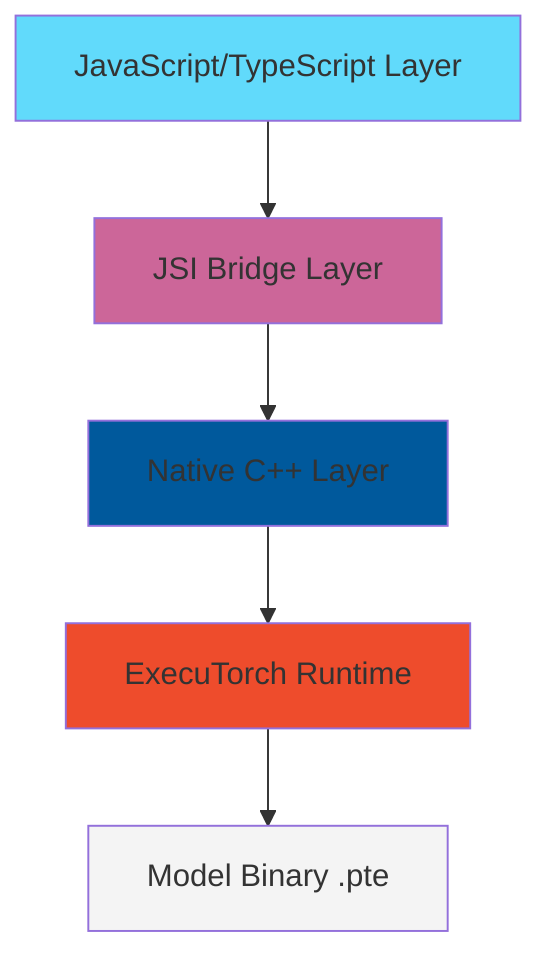
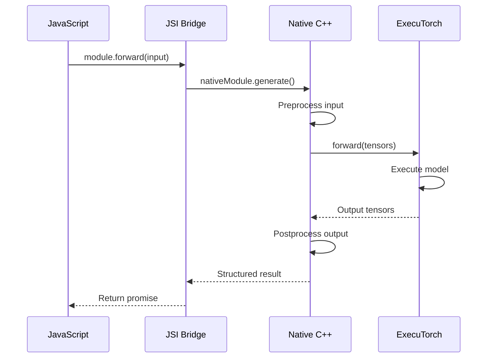

## Overview

React Native ExecuTorch is a bridge that brings Meta's [ExecuTorch](https://pytorch.org/executorch/) runtime to React Native applications. It enables on-device AI inference by providing a JavaScript/TypeScript API layer on top of ExecuTorch's native C++ runtime.

## What is ExecuTorch?

ExecuTorch is PyTorch's solution for running ML models on edge devices. It provides:

- **Lightweight runtime**: Optimized for mobile and embedded devices
- **Edge-optimized models**: Compiled `.pte` (PyTorch ExecuTorch) model files
- **Efficient execution**: Minimal memory footprint and fast inference
- **Hardware acceleration**: Support for device-specific backends (CPU, GPU, NPU)

## Architecture Layers

React Native ExecuTorch is built in three main layers:



### 1. JavaScript/TypeScript Layer

The top layer provides a developer-friendly API with:

**Modules**: High-level classes for specific AI tasks
- `LLMModule` - Large Language Models
- `ClassificationModule` - Image classification
- `ObjectDetectionModule` - Object detection
- `OCRModule` - Optical character recognition
- `ExecutorchModule` - Generic model execution
- And many more...

**Hooks**: React hooks for seamless integration
```typescript
const llm = useLLM({
  modelSource: 'https://example.com/model.pte',
  tokenizerSource: 'https://example.com/tokenizer.json',
});
```

**Types**: Full TypeScript support with type-safe APIs
```typescript
interface TensorPtr {
  dataPtr: TensorBuffer;
  sizes: number[];
  scalarType: ScalarType;
}
```

### 2. JSI Bridge Layer

JavaScript Interface (JSI) enables direct synchronous communication between JavaScript and C++:

- **Zero-copy data transfer**: Native buffers shared between JS and C++
- **Synchronous calls**: No serialization overhead
- **Worklet support**: Frame processing on Vision Camera thread
- **Global functions**: Direct access to native module loaders

```typescript
// Global JSI functions installed at runtime
declare global {
  var loadExecutorchModule: (source: string) => any;
  var loadLLM: (modelSource: string, tokenizerSource: string) => any;
  var loadClassification: (source: string) => any;
  // ... more module loaders
}
```

Location in source: `~/workspace/source/packages/react-native-executorch/src/index.ts:36-92`

### 3. Native C++ Layer

The native layer handles:

- **Model loading**: Loading `.pte` files into memory
- **Input preprocessing**: Image normalization, tensor creation
- **Inference execution**: Running forward passes through ExecuTorch
- **Output postprocessing**: Converting raw tensors to structured results
- **Memory management**: Resource cleanup and lifecycle management

### 4. ExecuTorch Runtime

Meta's ExecuTorch runtime provides:

- Model execution engine
- Operator implementations
- Backend delegates (CPU, GPU, etc.)
- Memory allocators

## Module System

All modules extend from `BaseModule` which provides core functionality:

```typescript
abstract class BaseModule {
  // Native JSI Host Object
  nativeModule: any = null;
  
  // Load model into memory
  abstract load(
    modelSource: ResourceSource,
    onDownloadProgressCallback: (progress: number) => void,
    ...args: any[]
  ): Promise<void>;
  
  // Run inference (bound to JSI function after load)
  generateFromFrame!: (frameData: Frame, ...args: any[]) => any;
  
  // Run raw tensor inference
  protected forwardET(inputTensor: TensorPtr[]): Promise<TensorPtr[]>;
  
  // Release native resources
  delete(): void;
}
```

Location: `~/workspace/source/packages/react-native-executorch/src/modules/BaseModule.ts:12-105`

### Specialized Modules

**Vision Modules** extend `VisionModule` for image processing:
```typescript
abstract class VisionModule<TOutput> extends BaseModule {
  // Unified API for string paths or pixel data
  async forward(input: string | PixelData, ...args: any[]): Promise<TOutput>;
  
  // Worklet-compatible frame processor
  get runOnFrame(): ((frame: Frame, ...args: any[]) => TOutput) | null;
}
```

Location: `~/workspace/source/packages/react-native-executorch/src/modules/computer_vision/VisionModule.ts:32-143`

**LLM Module** uses a controller pattern for conversation management:
```typescript
class LLMModule {
  private controller: LLMController;
  
  async load(model: {
    modelSource: ResourceSource;
    tokenizerSource: ResourceSource;
    tokenizerConfigSource: ResourceSource;
  }): Promise<void>;
  
  async sendMessage(message: string): Promise<Message[]>;
  async generate(messages: Message[], tools?: LLMTool[]): Promise<string>;
  async forward(input: string): Promise<string>;
}
```

Location: `~/workspace/source/packages/react-native-executorch/src/modules/natural_language_processing/LLMModule.ts:10-187`

## Data Flow

Here's how data flows through a typical inference call:



## Frame Processing Pipeline

For real-time vision applications with VisionCamera:


**Zero-copy path** (recommended):
```typescript
const frameOutput = useFrameOutput({
  onFrame(frame) {
    'worklet';
    const nativeBuffer = frame.getNativeBuffer();
    const result = model.runOnFrame({
      nativeBuffer: nativeBuffer.pointer,
      width: frame.width,
      height: frame.height
    });
    nativeBuffer.release();
    frame.dispose();
  }
});
```

## Initialization

The library must be initialized with a ResourceFetcher adapter:

```typescript
import { initExecutorch } from 'react-native-executorch';
import { ExpoResourceFetcher } from '@react-native-executorch/expo-resource-fetcher';

// Initialize once at app startup
initExecutorch({
  resourceFetcher: ExpoResourceFetcher
});
```

This installs JSI functions globally:

Location: `~/workspace/source/packages/react-native-executorch/src/index.ts:94-117`

## Platform Support

React Native ExecuTorch supports:

- **iOS**: Native C++ integration via CocoaPods
- **Android**: Native C++ integration via Gradle
- **Expo**: Via development builds with config plugins
- **Bare React Native**: Direct native module linking

## Performance Characteristics

**Model Loading**:
- One-time operation per model
- Downloads cached in app document directory
- Progress tracking available

**Inference**:
- Synchronous execution (blocks thread)
- Typically 10-500ms depending on model size
- Can run on background thread via JSI worklets

**Memory**:
- Models loaded into native heap
- Must call `module.delete()` to release
- Large models (1GB+) require careful lifecycle management

## Next Steps

- [Resource Fetching](/core-concepts/resource-fetching) - Learn how models are downloaded and cached
- [Model Loading](/core-concepts/model-loading) - Understand the model loading process
- [Error Handling](/core-concepts/error-handling) - Handle errors gracefully in your app