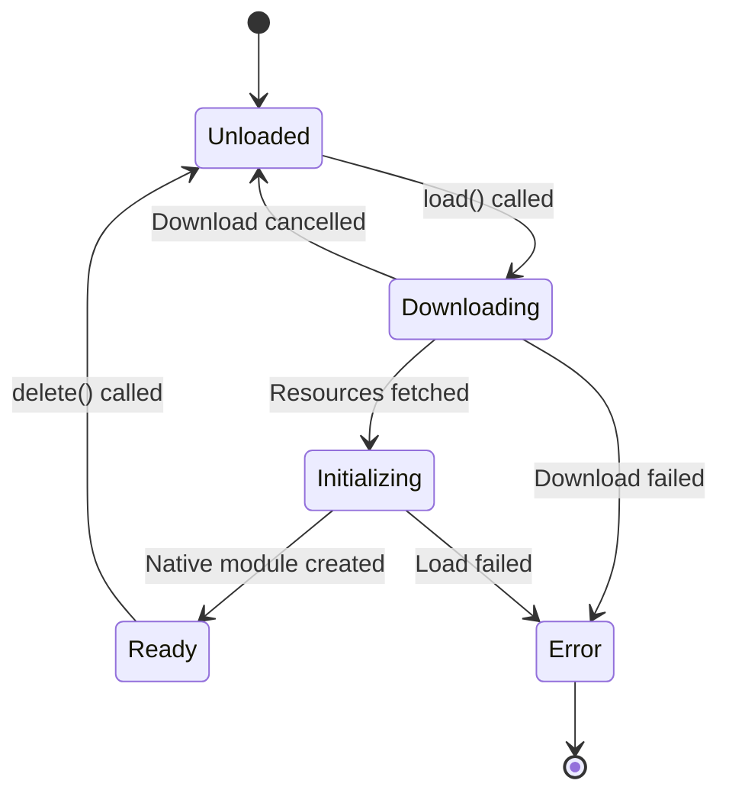

## Overview

Model loading is the process of downloading resources, preparing native modules, and loading ExecuTorch `.pte` model files into memory. This guide covers the complete loading lifecycle from resource fetching to ready-for-inference state.

## Loading Lifecycle



## Basic Loading Pattern

All modules follow this pattern:

```typescript
import { ExecutorchModule } from 'react-native-executorch';

const module = new ExecutorchModule();

// Load model with progress tracking
await module.load(
  'https://example.com/model.pte',
  (progress) => {
    console.log(`Loading: ${Math.round(progress * 100)}%`);
  }
);

// Module is now ready for inference
const output = await module.forward(inputTensors);

// Clean up when done
module.delete();
```

## Module-Specific Loading

Different modules require different resources:

### ExecutorchModule (Generic)

Simplest case - just a model binary:

```typescript
import { ExecutorchModule } from 'react-native-executorch';

const module = new ExecutorchModule();
await module.load(
  modelSource,
  (progress) => console.log(progress)
);
```

Location: `~/workspace/source/packages/react-native-executorch/src/modules/general/ExecutorchModule.ts:22-42`

Implementation:
```typescript
async load(
  modelSource: ResourceSource,
  onDownloadProgressCallback: (progress: number) => void = () => {}
): Promise<void> {
  try {
    // Fetch model file
    const paths = await ResourceFetcher.fetch(
      onDownloadProgressCallback,
      modelSource
    );
    
    if (!paths?.[0]) {
      throw new RnExecutorchError(
        RnExecutorchErrorCode.DownloadInterrupted,
        'Download was interrupted. Please retry.'
      );
    }
    
    // Load into native memory via JSI
    this.nativeModule = global.loadExecutorchModule(paths[0]);
  } catch (error) {
    Logger.error('Load failed:', error);
    throw parseUnknownError(error);
  }
}
```

### VisionModule (Image Models)

Vision models need only the model file:

```typescript
import { ClassificationModule } from 'react-native-executorch';

const classifier = new ClassificationModule();
await classifier.load(
  'https://example.com/mobilenet_v3.pte',
  (progress) => setProgress(progress)
);

// Ready for inference
const result = await classifier.forward('file:///path/to/image.jpg');
```

### LLMModule (Language Models)

LLMs require multiple resources:

```typescript
import { LLMModule } from 'react-native-executorch';

const llm = new LLMModule({
  tokenCallback: (token) => console.log(token),
  messageHistoryCallback: (history) => setMessages(history)
});

await llm.load(
  {
    modelSource: 'https://example.com/model.pte',
    tokenizerSource: 'https://example.com/tokenizer.json',
    tokenizerConfigSource: 'https://example.com/tokenizer_config.json'
  },
  (progress) => setProgress(progress)
);
```

Location: `~/workspace/source/packages/react-native-executorch/src/modules/natural_language_processing/LLMModule.ts:49-66`

### OCRModule (Text Recognition)

OCR needs detector, recognizer, and symbols:

```typescript
import { OCRModule } from 'react-native-executorch';
import { OCRLatinSymbols } from 'react-native-executorch';

const ocr = new OCRModule();
await ocr.load(
  {
    detectorSource: 'https://example.com/detector.pte',
    recognizerSource: 'https://example.com/recognizer.pte',
    symbols: OCRLatinSymbols
  },
  (progress) => setProgress(progress)
);
```

### TextToImageModule (Stable Diffusion)

Most complex - multiple models:

```typescript
import { TextToImageModule } from 'react-native-executorch';

const tti = new TextToImageModule();
await tti.load(
  {
    tokenizerSource: 'https://example.com/tokenizer.json',
    encoderSource: 'https://example.com/text_encoder.pte',
    unetSource: 'https://example.com/unet.pte',
    decoderSource: 'https://example.com/vae_decoder.pte',
    schedulerConfig: {
      betaStart: 0.00085,
      betaEnd: 0.012,
      numTrainTimesteps: 1000,
      stepsOffset: 1
    }
  },
  (progress) => setProgress(progress)
);
```

## Download Progress Tracking

### Single Resource

Progress from 0 to 1:

```typescript
const [progress, setProgress] = useState(0);
const [status, setStatus] = useState('Starting...');

await module.load(
  modelSource,
  (downloadProgress) => {
    setProgress(downloadProgress);
    
    if (downloadProgress === 0) {
      setStatus('Connecting...');
    } else if (downloadProgress < 1) {
      setStatus(`Downloading ${Math.round(downloadProgress * 100)}%`);
    } else {
      setStatus('Initializing model...');
    }
  }
);

setStatus('Ready!');
```

### Multiple Resources

Progress is weighted by file size:

```typescript
// Example: LLM with 3 files
// - model.pte: 1GB (80% of total)
// - tokenizer.json: 200MB (16% of total)
// - config.json: 50MB (4% of total)

await llm.load(
  {
    modelSource: largeModel,     // 1GB
    tokenizerSource: tokenizer,  // 200MB
    tokenizerConfigSource: config // 50MB
  },
  (progress) => {
    // Progress breakdown:
    // 0.0 - 0.8:   Downloading model.pte
    // 0.8 - 0.96:  Downloading tokenizer.json
    // 0.96 - 1.0:  Downloading config.json
    console.log(`Overall: ${Math.round(progress * 100)}%`);
  }
);
```

Implementation in ResourceFetcherUtils:

Location: `~/workspace/source/packages/react-native-executorch/src/utils/ResourceFetcherUtils.ts:155-181`

```typescript
export function calculateDownloadProgress(
  totalLength: number,
  previousFilesTotalLength: number,
  currentFileLength: number,
  setProgress: (downloadProgress: number) => void
) {
  return (progress: number) => {
    if (progress === 1 && 
        previousFilesTotalLength === totalLength - currentFileLength) {
      setProgress(1);
      return;
    }

    if (totalLength === 0) {
      setProgress(0);
      return;
    }

    const baseProgress = previousFilesTotalLength / totalLength;
    const scaledProgress = progress * (currentFileLength / totalLength);
    const updatedProgress = baseProgress + scaledProgress;
    setProgress(updatedProgress);
  };
}
```

## Native Module Initialization

After resources are downloaded, native modules are created via JSI:

### Global JSI Functions

These functions are installed at app startup:

```typescript
declare global {
  // Generic model
  var loadExecutorchModule: (source: string) => any;
  
  // Vision models
  var loadClassification: (source: string) => any;
  var loadObjectDetection: (
    source: string,
    normMean: Triple<number> | [],
    normStd: Triple<number> | [],
    labelNames: string[]
  ) => any;
  var loadSemanticSegmentation: (
    source: string,
    normMean: Triple<number> | [],
    normStd: Triple<number> | [],
    allClasses: string[]
  ) => any;
  
  // NLP models
  var loadLLM: (
    modelSource: string,
    tokenizerSource: string
  ) => any;
  var loadTokenizerModule: (source: string) => any;
  
  // ... more model loaders
}
```

Location: `~/workspace/source/packages/react-native-executorch/src/index.ts:36-92`

### Installation

JSI functions are installed by the native module:

```typescript
if (
  global.loadExecutorchModule == null ||
  global.loadClassification == null ||
  // ... check all functions
) {
  if (!ETInstallerNativeModule) {
    throw new Error(
      `Failed to install react-native-executorch: Native module not found.`
    );
  }
  ETInstallerNativeModule.install();
}
```

Location: `~/workspace/source/packages/react-native-executorch/src/index.ts:94-117`

## Caching Behavior

### Automatic Caching

Downloaded files are cached in the app's document directory:

```
{DocumentDirectory}/react-native-executorch/
├── example.com_model.pte
├── example.com_tokenizer.json
├── huggingface.co_model_config.json
└── {hash}.json (for object sources)
```

### Cache Check

Before downloading, the fetcher checks if the file exists:

```typescript
// Pseudo-code from ResourceFetcher
const filename = getFilenameFromUri(uri);
const localPath = `${RNEDirectory}${filename}`;

if (await fileExists(localPath)) {
  // Use cached file, skip download
  return localPath;
}

// File not found, download it
const downloadedPath = await downloadFile(uri, localPath);
return downloadedPath;
```

### Subsequent Loads

After first load, subsequent loads are instant:

```typescript
// First load: Downloads from network (slow)
await module.load(
  'https://example.com/model.pte',
  (progress) => console.log(progress)
);
// Takes 30 seconds for 1GB model

module.delete();

// Second load: Uses cached file (fast)
const module2 = new ExecutorchModule();
await module2.load(
  'https://example.com/model.pte',
  (progress) => console.log(progress)
);
// Takes ~2 seconds to load from disk into memory
```

## Error Handling

### Common Loading Errors

```typescript
import { RnExecutorchErrorCode, RnExecutorchError } from 'react-native-executorch';

try {
  await module.load(modelSource, (p) => setProgress(p));
} catch (error) {
  if (error instanceof RnExecutorchError) {
    switch (error.code) {
      case RnExecutorchErrorCode.ResourceFetcherAdapterNotInitialized:
        console.error('Did you call initExecutorch()?');
        break;
      
      case RnExecutorchErrorCode.ResourceFetcherDownloadFailed:
        console.error('Download failed:', error.message);
        // Retry or show error to user
        break;
      
      case RnExecutorchErrorCode.DownloadInterrupted:
        console.error('Download was cancelled or paused');
        break;
      
      case RnExecutorchErrorCode.InvalidProgram:
        console.error('Invalid model file - corrupted or wrong format');
        break;
      
      case RnExecutorchErrorCode.MemoryAllocationFailed:
        console.error('Not enough memory to load model');
        break;
      
      default:
        console.error('Unexpected error:', error.code, error.message);
    }
  }
}
```

### Download Interruption

If download is cancelled or paused, `load()` throws:

```typescript
const paths = await ResourceFetcher.fetch(
  onDownloadProgressCallback,
  modelSource
);

if (!paths?.[0]) {
  throw new RnExecutorchError(
    RnExecutorchErrorCode.DownloadInterrupted,
    'The download has been interrupted. Please retry the download.'
  );
}
```

Location: `~/workspace/source/packages/react-native-executorch/src/modules/general/ExecutorchModule.ts:31-35`

## Memory Management

### Model in Memory

Loaded models reside in native heap:

```typescript
// Model loaded into native memory
await module.load(modelSource);

// Check memory usage (iOS)
// Settings > App > Memory: +500MB

// JavaScript references native object
console.log(module.nativeModule); // JSI HostObject
```

### Cleanup

Always call `delete()` when done:

```typescript
class MyComponent extends React.Component {
  module = new ExecutorchModule();
  
  async componentDidMount() {
    await this.module.load(modelSource);
  }
  
  componentWillUnmount() {
    // IMPORTANT: Release native memory
    this.module.delete();
  }
  
  render() {
    // ...
  }
}
```

Or with hooks:

```typescript
function useModel(modelSource: ResourceSource) {
  const moduleRef = useRef<ExecutorchModule | null>(null);
  const [isLoaded, setIsLoaded] = useState(false);
  
  useEffect(() => {
    const module = new ExecutorchModule();
    moduleRef.current = module;
    
    module.load(modelSource).then(() => {
      setIsLoaded(true);
    });
    
    return () => {
      // Cleanup on unmount
      module.delete();
    };
  }, [modelSource]);
  
  return { module: moduleRef.current, isLoaded };
}
```

### Multiple Models

You can load multiple models simultaneously:

```typescript
const classifier = new ClassificationModule();
const detector = new ObjectDetectionModule();

// Load both in parallel
await Promise.all([
  classifier.load(classifierModel),
  detector.load(detectorModel)
]);

// Use both
const classification = await classifier.forward(image);
const detections = await detector.forward(image);

// Clean up both
classifier.delete();
detector.delete();
```

**Note**: Be mindful of memory constraints on mobile devices.

## Preloading Strategies

### App Startup

Load critical models at startup:

```typescript
import { initExecutorch } from 'react-native-executorch';
import { ExpoResourceFetcher } from '@react-native-executorch/expo-resource-fetcher';

export default function App() {
  const [isReady, setIsReady] = useState(false);
  
  useEffect(() => {
    async function prepare() {
      // Initialize resource fetcher
      initExecutorch({ resourceFetcher: ExpoResourceFetcher });
      
      // Preload model
      const module = new ClassificationModule();
      await module.load(CRITICAL_MODEL);
      
      // Store in global state or context
      AppState.classifierModule = module;
      
      setIsReady(true);
    }
    
    prepare();
  }, []);
  
  if (!isReady) {
    return <SplashScreen />;
  }
  
  return <MainApp />;
}
```

### Background Download

Download large models in background:

```typescript
import { ResourceFetcher } from 'react-native-executorch';

function useBackgroundModelDownload(modelUrl: string) {
  const [progress, setProgress] = useState(0);
  const [isDownloaded, setIsDownloaded] = useState(false);
  
  useEffect(() => {
    // Start download
    ResourceFetcher.fetch(
      (p) => setProgress(p),
      modelUrl
    ).then((paths) => {
      if (paths) {
        setIsDownloaded(true);
      }
    });
  }, [modelUrl]);
  
  return { progress, isDownloaded };
}

// In your component
function ModelDownloader() {
  const { progress, isDownloaded } = useBackgroundModelDownload(MODEL_URL);
  
  return (
    <View>
      {isDownloaded ? (
        <Text>Model ready!</Text>
      ) : (
        <ProgressBar value={progress} />
      )}
    </View>
  );
}
```

### Lazy Loading

Load models on-demand:

```typescript
function Camera() {
  const [detector, setDetector] = useState<ObjectDetectionModule | null>(null);
  
  async function enableObjectDetection() {
    const module = new ObjectDetectionModule();
    await module.load(DETECTOR_MODEL);
    setDetector(module);
  }
  
  useEffect(() => {
    return () => {
      detector?.delete();
    };
  }, [detector]);
  
  return (
    <View>
      {detector ? (
        <CameraWithDetection detector={detector} />
      ) : (
        <Button onPress={enableObjectDetection} title="Enable AI" />
      )}
    </View>
  );
}
```

## Best Practices

1. **Initialize early**: Call `initExecutorch()` before any model loading
2. **Show progress**: Always provide progress callbacks for better UX
3. **Handle errors**: Catch and display loading errors appropriately
4. **Clean up**: Call `delete()` in cleanup functions (componentWillUnmount, useEffect return)
5. **Cache awareness**: Subsequent loads are fast - don't block UI unnecessarily
6. **Memory constraints**: Monitor memory usage on low-end devices
7. **Preload critical models**: Load frequently-used models at startup
8. **Lazy load optional models**: Load feature-specific models on-demand

## Next Steps

- [Error Handling](/core-concepts/error-handling) - Learn about all error types and how to handle them
- [Resource Fetching](/core-concepts/resource-fetching) - Deep dive into resource management