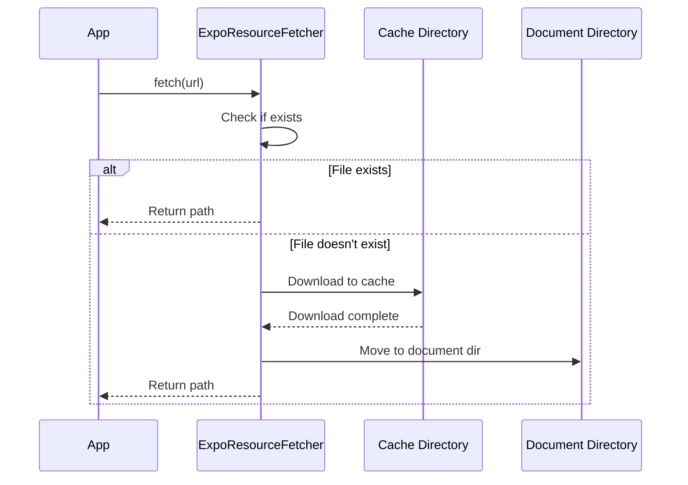

## Overview

React Native ExecuTorch uses a **ResourceFetcher** abstraction to handle downloading and caching of model files, tokenizers, and other resources. The system supports multiple source types and provides progress tracking, pause/resume, and efficient caching.

## ResourceFetcher Adapter Pattern

The library uses an adapter pattern to support different React Native setups:

```mermaid
graph TB
    A[ResourceFetcher Core] --> B[ResourceFetcherAdapter Interface]
    B --> C[ExpoResourceFetcher]
    B --> D[BareResourceFetcher]
    
    C --> E[Expo FileSystem]
    D --> F[React Native FS]
    
    style A fill:#61dafb
    style B fill:#f4f4f4
    style C fill:#000020
    style D fill:#cc6699
```



### ResourceFetcherAdapter Interface

All adapters must implement this minimal interface:

```typescript
interface ResourceFetcherAdapter {
  /**
   * Fetch resources (remote URLs, local files, or embedded assets)
   * @param callback - Progress callback (0-1)
   * @param sources - Resource sources to fetch
   * @returns Array of local file paths, or null if interrupted
   */
  fetch(
    callback: (downloadProgress: number) => void,
    ...sources: ResourceSource[]
  ): Promise<string[] | null>;

  /**
   * Read file contents as a string
   * @param path - Absolute file path
   * @returns File contents
   */
  readAsString(path: string): Promise<string>;
}
```

Location: `~/workspace/source/packages/react-native-executorch/src/utils/ResourceFetcher.ts:18-45`

## ResourceSource Types

The `ResourceSource` type accepts multiple formats:

```typescript
type ResourceSource = string | number | object;
```

### String Sources

**Remote URLs**:
```typescript
const url = 'https://example.com/model.pte';
await ResourceFetcher.fetch(() => {}, url);
// Downloads to: {documentDir}/react-native-executorch/example.com_model.pte
```

**Local file paths**:
```typescript
const localPath = '/path/to/local/model.pte';
await ResourceFetcher.fetch(() => {}, localPath);
// Returns: /path/to/local/model.pte (no download)
```

**File URIs**:
```typescript
const fileUri = 'file:///data/user/0/com.app/model.pte';
await ResourceFetcher.fetch(() => {}, fileUri);
// Returns: /data/user/0/com.app/model.pte (strips file:// prefix)
```

### Number Sources (Bundled Assets)

```typescript
// In your code:
const modelAsset = require('./assets/model.pte');
await ResourceFetcher.fetch(() => {}, modelAsset);

// Expo: Copies from bundle to document directory
// Bare: Resolves via Image.resolveAssetSource()
```

### Object Sources (Configuration)

```typescript
const config = {
  version: '1.0',
  params: { temperature: 0.7 }
};
await ResourceFetcher.fetch(() => {}, config);
// Saves as: {documentDir}/react-native-executorch/{hash}.json
```

Location: `~/workspace/source/packages/react-native-executorch/src/types/common.ts:10`

## Core ResourceFetcher API

The static `ResourceFetcher` class delegates to the configured adapter:

```typescript
class ResourceFetcher {
  private static adapter: ResourceFetcherAdapter | null = null;
  
  // Set adapter (called by initExecutorch)
  static setAdapter(adapter: ResourceFetcherAdapter): void;
  
  // Get current adapter (throws if not initialized)
  static getAdapter(): ResourceFetcherAdapter;
  
  // Fetch resources
  static async fetch(
    callback: (progress: number) => void,
    ...sources: ResourceSource[]
  ): Promise<string[] | null>;
  
  // File system utilities
  static fs = {
    readAsString: async (path: string) => Promise<string>
  };
}
```

Location: `~/workspace/source/packages/react-native-executorch/src/utils/ResourceFetcher.ts:53-142`

### Error Handling

If adapter is not initialized:

```typescript
try {
  await ResourceFetcher.fetch(() => {}, modelUrl);
} catch (error) {
  if (error.code === RnExecutorchErrorCode.ResourceFetcherAdapterNotInitialized) {
    console.error('Call initExecutorch() first!');
  }
}
```

Location: `~/workspace/source/packages/react-native-executorch/src/utils/ResourceFetcher.ts:87-95`

## ExpoResourceFetcher

For Expo applications (requires development build):

```typescript
import { initExecutorch } from 'react-native-executorch';
import { ExpoResourceFetcher } from '@react-native-executorch/expo-resource-fetcher';

initExecutorch({
  resourceFetcher: ExpoResourceFetcher
});
```

### Implementation Details

**Uses**:
- `expo-file-system/legacy` for downloads and file operations
- `expo-asset` for bundled asset resolution
- Caching directory for temporary downloads
- Document directory for final storage

**Storage Location**:
```
{documentDirectory}/react-native-executorch/
```

**Download Flow**:


Location: `~/workspace/source/packages/expo-resource-fetcher/src/ResourceFetcher.ts:100-561`

### Key Methods

**Pause/Resume/Cancel**:
```typescript
// Start download
const fetchPromise = ExpoResourceFetcher.fetch(
  (progress) => console.log(progress),
  modelUrl
);

// Pause download
await ExpoResourceFetcher.pauseFetching(modelUrl);

// Resume download
const paths = await ExpoResourceFetcher.resumeFetching(modelUrl);

// Cancel download
await ExpoResourceFetcher.cancelFetching(modelUrl);
```

Location: `~/workspace/source/packages/expo-resource-fetcher/src/ResourceFetcher.ts:290-321`

**File Management**:
```typescript
// List all downloaded files
const files = await ExpoResourceFetcher.listDownloadedFiles();
// Returns: ['/path/to/file1.pte', '/path/to/file2.json', ...]

// List only models (.pte files)
const models = await ExpoResourceFetcher.listDownloadedModels();
// Returns: ['/path/to/model1.pte', '/path/to/model2.pte']

// Delete resources
await ExpoResourceFetcher.deleteResources(modelUrl, tokenizerUrl);

// Get total size of resources
const bytes = await ExpoResourceFetcher.getFilesTotalSize(url1, url2);
```

Location: `~/workspace/source/packages/expo-resource-fetcher/src/ResourceFetcher.ts:336-381`

## BareResourceFetcher

For bare React Native applications:

```typescript
import { initExecutorch } from 'react-native-executorch';
import { BareResourceFetcher } from '@react-native-executorch/bare-resource-fetcher';

initExecutorch({
  resourceFetcher: BareResourceFetcher
});
```

### Implementation Details

**Uses**:
- `@dr.pogodin/react-native-fs` for file operations
- `@kesha-antonov/react-native-background-downloader` for downloads
- `Image.resolveAssetSource()` for bundled assets

**Storage Location**:
```
{DocumentDirectoryPath}/react-native-executorch/
```

**Download with Background Support**:
```typescript
const task = createDownloadTask({
  id: filename,
  url: uri,
  destination: cacheFileUri
})
  .begin(() => callback(0))
  .progress((p) => callback(p.bytesDownloaded / p.bytesTotal))
  .done(async () => {
    await moveFile(cacheFileUri, finalFileUri);
  })
  .error((error) => {
    throw new RnExecutorchError(
      RnExecutorchErrorCode.ResourceFetcherDownloadFailed,
      `Failed to fetch: ${error}`
    );
  });
```

Location: `~/workspace/source/packages/bare-resource-fetcher/src/ResourceFetcher.ts:517-558`

### API

Identical to ExpoResourceFetcher:
- `fetch()` - Download resources
- `pauseFetching()` - Pause downloads
- `resumeFetching()` - Resume downloads
- `cancelFetching()` - Cancel downloads
- `listDownloadedFiles()` - List files
- `deleteResources()` - Delete files

Location: `~/workspace/source/packages/bare-resource-fetcher/src/ResourceFetcher.ts:103-572`

## Progress Tracking

Progress callbacks report download progress from 0 to 1:

```typescript
const [progress, setProgress] = useState(0);

await ResourceFetcher.fetch(
  (downloadProgress) => {
    setProgress(downloadProgress);
    console.log(`${Math.round(downloadProgress * 100)}%`);
  },
  modelUrl,
  tokenizerUrl
);
```

### Multi-file Progress

When fetching multiple files, progress is weighted by file size:

```typescript
// Downloads 3 files: 100MB + 50MB + 50MB = 200MB total
await ResourceFetcher.fetch(
  (progress) => {
    // progress is weighted:
    // - 0.0 -> 0.5: First file (100MB)
    // - 0.5 -> 0.75: Second file (50MB)
    // - 0.75 -> 1.0: Third file (50MB)
    setProgress(progress);
  },
  largeModel,  // 100MB
  tokenizer,   // 50MB
  config       // 50MB
);
```

Location: `~/workspace/source/packages/react-native-executorch/src/utils/ResourceFetcherUtils.ts:155-181`

## Caching Strategy

### Cache Check

```typescript
// Before downloading, checks if file exists:
const filename = getFilenameFromUri(uri);
const fileUri = `${RNEDirectory}${filename}`;

if (await checkFileExists(fileUri)) {
  return removeFilePrefix(fileUri); // Use cached file
}

// Otherwise, download
```

### Filename Generation

URLs are converted to safe filenames:

```typescript
function getFilenameFromUri(uri: string): string {
  let cleanUri = uri.replace(/^https?:\/\//, '');
  cleanUri = cleanUri.split('#')?.[0] ?? cleanUri;
  return cleanUri.replace(/[^a-zA-Z0-9._-]/g, '_');
}

// Examples:
// 'https://example.com/model.pte' -> 'example.com_model.pte'
// 'https://huggingface.co/models/llama.pte?v=2' -> 'huggingface.co_models_llama.pte_v_2'
```

Location: `~/workspace/source/packages/react-native-executorch/src/utils/ResourceFetcherUtils.ts:204-208`

### Cache Invalidation

Currently, there's no automatic cache invalidation. To force re-download:

```typescript
// Delete cached file
await ExpoResourceFetcher.deleteResources(modelUrl);

// Next fetch will re-download
await ResourceFetcher.fetch(() => {}, modelUrl);
```

## Hugging Face Integration

Downloads from Hugging Face automatically increment download counters:

```typescript
export async function triggerHuggingFaceDownloadCounter(uri: string) {
  const url = new URL(uri);
  if (
    url.host === 'huggingface.co' &&
    url.pathname.startsWith('/software-mansion/')
  ) {
    const baseUrl = `${url.protocol}//${url.host}${url.pathname.split('resolve')[0]}`;
    fetch(`${baseUrl}resolve/main/config.json`, { method: 'HEAD' });
  }
}
```

Location: `~/workspace/source/packages/react-native-executorch/src/utils/ResourceFetcherUtils.ts:188-197`

## Resource Types

### Source Type Detection

The fetcher automatically detects source types:

```typescript
enum SourceType {
  OBJECT,              // Plain JavaScript object
  LOCAL_FILE,          // File path (file:// or absolute)
  RELEASE_MODE_FILE,   // Bundled asset (number)
  DEV_MODE_FILE,       // Metro-served asset (number in dev)
  REMOTE_FILE,         // HTTP/HTTPS URL
}
```

Location: `~/workspace/source/packages/react-native-executorch/src/utils/ResourceFetcherUtils.ts:40-65`

### Handling Each Type

```typescript
switch (sourceType) {
  case SourceType.OBJECT:
    // Hash object, save as JSON
    return await handleObject(source);
  
  case SourceType.LOCAL_FILE:
    // Return path as-is (strip file:// if present)
    return handleLocalFile(source);
  
  case SourceType.RELEASE_MODE_FILE:
    // Copy from bundle to document directory
    return await handleReleaseModeFile(source);
  
  case SourceType.DEV_MODE_FILE:
    // Resolve Metro URL and download
    return await handleDevModeFile(source);
  
  case SourceType.REMOTE_FILE:
    // Download from URL
    return await handleRemoteFile(source);
}
```

Location: `~/workspace/source/packages/expo-resource-fetcher/src/ResourceFetcher.ts:159-198`

## Best Practices

1. **Initialize early**: Call `initExecutorch()` at app startup
2. **Show progress**: Use progress callbacks for large downloads
3. **Handle interruptions**: Check for `null` return (download cancelled)
4. **Clean up**: Delete unused models to save space
5. **Error handling**: Catch and handle `ResourceFetcherDownloadFailed` errors

```typescript
import { RnExecutorchErrorCode } from 'react-native-executorch';

try {
  const paths = await ResourceFetcher.fetch(
    (progress) => setProgress(progress),
    modelUrl
  );
  
  if (paths === null) {
    // Download was cancelled or paused
    console.log('Download interrupted');
    return;
  }
  
  console.log('Downloaded to:', paths[0]);
} catch (error) {
  if (error.code === RnExecutorchErrorCode.ResourceFetcherDownloadFailed) {
    console.error('Download failed:', error.message);
  }
}
```

## Next Steps

- [Model Loading](/core-concepts/model-loading) - Learn how to load models after fetching
- [Error Handling](/core-concepts/error-handling) - Handle resource fetching errors